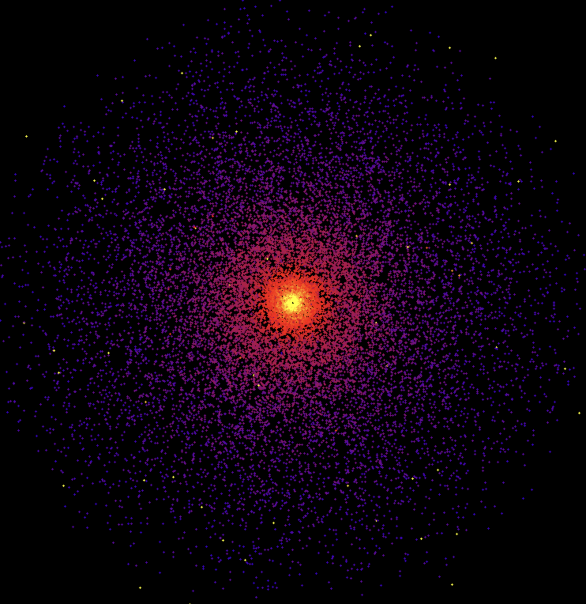
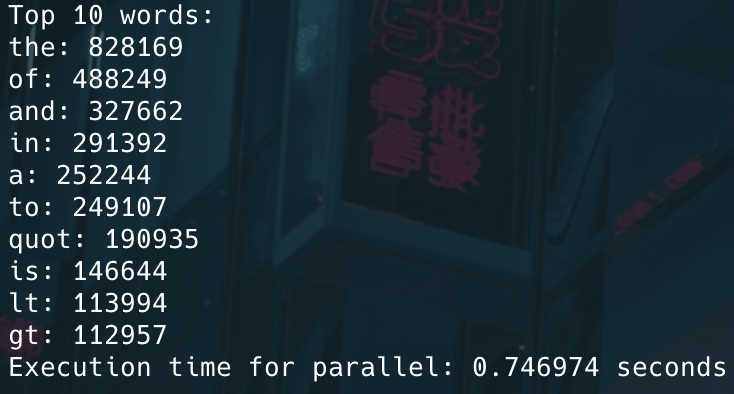
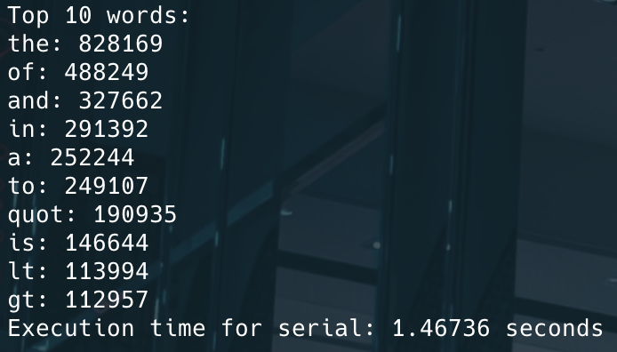

# OpenMP Playground

This repo contains some programs I am making to explore and get familiar with OpenMP and multi-threading in general.

## NBody

A gravity particle simulation for the N Body problem.  
Fun to make and really shocking how much threading increased performance.  
With my 8-core machine, 20,000 particles run smoothly at ~120 FPS, whereas with no threads, 20,000 particles is very choppy.  
Use scroll to zoom in and out.  



## WordCount

A parallel word counting program that demonstrates basic OpenMP threading techniques. Based off the Map Reduce framework but instead of multiple machines it is multiple threads.

This program can process text files in both serial and parallel modes, counting word frequencies and displaying the most common words. The parallel implementation uses OpenMP to divide the work across multiple threads, demonstrating significant performance improvements on large files.

The improvements seen are around 2x faster for parallel on my 8 core machine.

<div style="display: flex; justify-content: space-around;">
    
    
</div>

### Usage

```bash
./WordCount <filename> <mode: serial|parallel> [num_threads]
```
